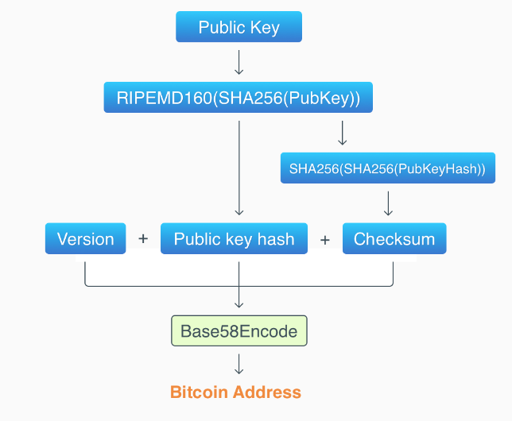

# 实验二 区块链的基本结构

## 实验目的

- 了解区块链上的简单数据结构
- 实现Merkle树的构建
- 初步理解UTXO的使用和验证
- 理解比特币上的交易创建

## 实验介绍

### 区块链

区块链是一种数字账本，它通过链式连接的方式连接各个区块，形成一个不断增长的分布式账本系统。在此过程中，我们在对每个区块的数据进行操作时，保存上一个区块头的信息，以确保它们形成完整的序列关系。


例如在我们的代码中，`NewGenesisBlock`代表了创建一个创世区块的意思。`MineBlock`代表了生成一个区块

因为我们在实验中使用了区块链，对应区块链的结构

```
type Blockchain struct {
	tip []byte
	db  *bolt.DB
}
```

`tip`代表了最新区块的哈希值，`db`表示了数据库的连接

### 区块

区块是区块链的重要组成部分，用于存储信息。一个区块由区块头和区块体组成，其中区块头是其唯一标识。区块头通常包括版本号、上一个区块哈希值、当前区块交易哈希值、时间戳、难度值和Nonce随机数等信息。在比特币中，计算区块头哈希可以确定前一个区块是否相同。

本实验中，我们定义了一个简化的区块结构，其包括区块头和区块体。其中块头用于唯一标识区块，包含版本号、上一个区块哈希值、当前区块交易哈希值、Merkle根、时间戳、难度值和Nonce随机数等信息。区块体则存储具体的数据内容。

```go
type Block struct {
	Header *BlkHeader
	Body   *BlkBody
}

type BlkHeader struct {
	Version       int64
	PrevBlockHash []byte
	MerkleRoot    []byte
	Timestamp     int64
	Bits          int64
	Nonce         int64
}

type BlkBody struct {
	Transactions Transactions
}
```

在这些信息中，`Timestamp`代表了整个区块对应的时间戳，`Data`当前区块存储的数据。`PrevBlockHash`代表了前一个区块对应的区块头。`Hash`代表了当前区块的区块头。`Nonce`代表了这个区块对应的随机数。

在这些信息中，区块头信息的Hash值可以作为一个区块的唯一索引，其中每个字段的含义如下：
- `Version` 代表区块的版本号
- `PrevBlockHash`代表了前一个区块对应的区块头。
- `MerkeRoot`代表一个区块交易的Merkle根
- `Timestamp`代表了整个区块对应的时间戳。
- `Bits` 代表一个区块计算的难度值
- `Nonce`代表了这个区块计算时对应的随机数。

在区块中的Hash值通常采用*SHA-256*的方式来进行加密，在Go语言中，我们可以调用函数`sha256.Sum256`来对于*[]byte*的数据进行加密工作。
区块体存储区块的具体内容，通常情况下区块体存储的数据量相对比较大。本次试验中，区块体对应存储交易的内容。

### Merkle树

在比特币的白皮书中，是通过***SPV***（ Simplified Payment Verification）的方式来进行交易认证的。通过这个机制，我们可以让多个轻节点依赖一个全节点来运行。

在Merkle树结构中，我们需要对每一个区块进行节点建立，他是从叶子节点开始建立的。首先，对于叶子节点，我们会进行哈希加密（在比特币中采用了双重SHA加密哈希的方式,此前实验中我们使用**单次sha256的方式加密**）。如果结点个数为奇数，那么最后一个节点会把最后一个交易复制一份，来保证数量为偶。

在Merkle树构建过程中，我们从底部开始，对节点进行哈希合并操作，直到节点数量减少为1。这个时候，对应的Merkle根的哈希值对应就是这个区块中所有交易的一个表示，并且会在后续的POW中使用。

这样做的好处是，对于一个轻节点，我们进行对于特定交易认证的时候，我们不需要下载区块中包含的所有交易，而只需要验证对应的Merkle根节点和对应的SPV路径。简单的Merkle树示例可以参考图片

Merkle tree的原理部分可以[参考资料](https://en.bitcoin.it/wiki/Protocol_documentation#Merkle_Trees)


### UTXO

UTXO是Unspent Transaction Outputs的缩写，中文翻译是没有花掉的交易输出，实际可以理解为在一次转账时剩余没有转出的资金。UTXO的交易模型上，用户通过使用未使用的交易输出（UTXO）来执行一笔交易。


在UTXO中，交易的转账方需要通过签名来证明自己是UTXO的合法使用者，并且通过输出脚本来限制收款方是谁。在比特币中，通过执行`Script`脚本来限制交易的接收方和验证方。在一笔UTXO的交易中，**每个输入都指向之前一些输出，每个输出中存储了具体的交易金额数量。**在UTXO中一个显著的特点就是单个输出是不可分的，如果只需要部分输出，可以生成一笔UTXO交易，把金额分为两个不同的部分。

```
type Transaction struct {
	ID   []byte
	Vin  []TXInput
	Vout []TXOutput
}

type TXInput struct {
	Txid      []byte
	Vout      int
	Signature []byte
	PubKey    []byte
}

type TXOutput struct {
	Value      int
	PubKeyHash []byte
}
```

在`TXOutput`中，`Value`字段对应是存储的金额大小，锁定脚本是通过 `PubKeyHash`来规定的，对应是用户的公钥地址的哈希值。

在`TXInput`中，`Txid`字段存储了对应交易的哈希值，`Vout`字段存储了上一笔交易的索引，`Signature`存储了交易的签名，`PubKey`存储了公钥。

### Coinbase交易

在UTXO模型中中，先有输入还是输出是一个先有鸡还是先有蛋的问题。在比特币中，输出可以在输入之前创建。在矿工成功的挖出一个新的区块的时候，可以加入一笔**coinbase**交易。coinbase交易指的是只有输出，没有输入的交易，他只允许出现在一个区块的第一笔交易，并且没有之前的输入。在我们的设计中，coinbase交易中对应的输入中`Txid` 为空，`Vout`对应为-1，并且是一个区块的**第一笔交易**。

### 比特币上的地址

比特币上的地址是通过公钥生成的一个数据，是通过`RIPEMD16`和`sha256`加密，`Base58`编码生成，对应生成比特币上的方法如下：



1. 计算公钥的哈希值（`RIPEMD16(SHA256(PubKey))`）
2.  地址计算前加入版本号
3. 把步骤2的内容通过计算公钥哈希的双重SHA256哈希加密，取**前4个字节**作为校验和
4. `版本号，公钥哈希，校验和`的组合通过Base58加密生成比特币的地址

### P2PKH

P2PKH是 "Pay To Public Key Hash"的缩写，指的是向公钥的哈希支付，是一种比较常见的比特币上的脚本使用方式。在本次试验中，我们是基于这个方式来编写锁定脚本和解锁脚本的。

P2PKH对应的计算脚本如下：

```
<signature> <pubKey> OP_DUP OP_HASH160 <pubKeyHash> OP_EQUALVERIFY OP_CHECKSIG
```

在这个验证方式中，通过`OP_EQUALVERIFY`验证了公钥哈希是否和公钥一致，签名是否是和数据一致。

在这个试验中，我们先实现对于公钥验证的部分，func (out *TXOutput) Lock(address []byte)在中设置的锁定脚本需要和publickeyhash对应相同。
## 实验内容

### 目录结构

```

	
├── go.mod //go模块管理
├── merkle_tree.go //merkle树相关代码
├── merkle_tree_test.go //merkle树验证部分相关代码
├── proofofwork.go //POW验证相关代码，本次实验可以不使用
├── transaction.go //交易相关代码
├── util.go   //一些操作
├── utxo_set.go  //utxo结合相关代码，本次试验中可以不适用
└── wallet.go //wallet相关代码
├── TXInput.go  //交易输入相关代码
├── TXOutput.go //交易输出相关代码
├── block.go  //区块相关代码
├── blockchain.go  //区块链相关代码
```

### Merkle树部分

```
func NewMerkleTree(data [][]byte) *MerkleTree //生成Merkle树
func NewMerkleNode(left, right *MerkleNode, data []byte) *MerkleNode // 生成Merkle树节点
func (t *MerkleTree) SPVproof(index int) ([][]byte, error) //提供SPV path
func (t *MerkleTree) VerifyProof(index int, path [][]byte) (bool, error) //验证SPV路径
```

### Transaction部分

```
func (t *Transaction) IsCoinBase() bool //coinbase交易判断
```

### Wallet部分

```
func (w *Wallet) GetAddress() []byte //获取公钥对应的地址
```

### TXOutput部分

```
func (out *TXOutput) Lock(address []byte)   //设置锁定脚本PubkeyHash部分
```


## 参考资料

[比特币白皮书](https://bitcoin.org/bitcoin.pdf)

[比特币代码](https://github.com/bitcoin/bitcoin)

[Merkle Tree](https://en.bitcoin.it/wiki/Protocol_documentation#Merkle_Trees)

[区块链哈希算法](https://en.bitcoin.it/wiki/Block_hashing_algorithm)


