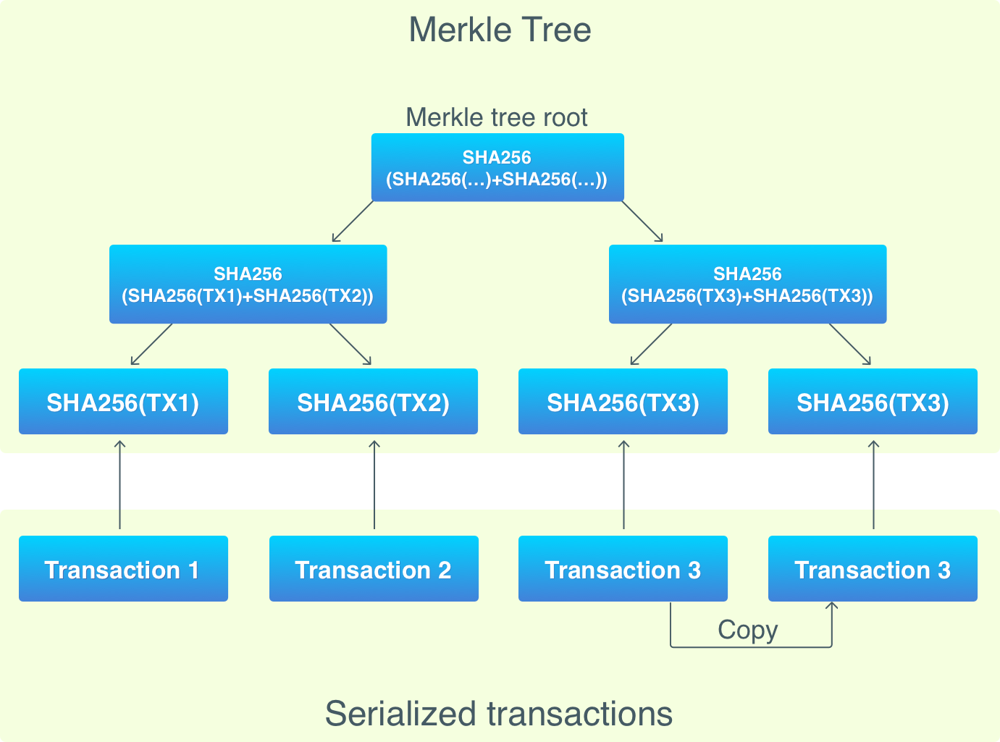

# 实验二 基于比特币区块链的简单搭建

## 实验目的

- 了解区块链上的简单数据结构
- 实现Merkle树的构建
- 实现区块链上的POW共识算法

## 实验介绍

### 区块链

区块链是通过链连接的区块的方式连接的数字账本，是一个不断增加的分布式账本。在链的层面，我们对应就是对一个个区块的数据进行的操作，来保证他们的串联成全序关系。


例如在我们的代码中，`NewGenesisBlock`代表了创建一个创世区块的意思。`addBlock`代表了添加单个区块。

因为我们在实验中使用了区块链，对应区块链的结构

```
type Blockchain struct {
	tip []byte
	db  *bolt.DB
}
```

`tip`代表了最新区块的哈希值，`db`表示了数据库的连接

### 区块

区块是区块链中重要的组成部分，在区块链中信息通常是在区块中进行存储的。区块的基本结构包括块头和区块体部分，区块头是区块的唯一标识。区块体存储区块的具体数据内容。例如，比特币中，区块头存储区块的版本，上一个区块的哈希值，当前区块对应交易的哈希值，时间戳，难度值，Nonce随机数。区块通过计算区块头的哈希来确定上一个区块是否对应一致。

在本次实验中，我们定义了一个简化版本的区块结构，大致的内容如下：

```
type Block struct {
	Timestamp     int64  // 时间戳
	Data          [][]byte //数据
	PrevBlockHash []byte //前一个区块的区块头的哈希值
	Hash          []byte //当前区块的区块头的哈希值
	Nonce         int //随机数
}
```

在这些信息中，`Timestamp`代表了整个区块对应的时间戳，`Data`当前区块存储的数据。`PrevBlockHash`代表了前一个区块对应的区块头。`Hash`代表了当前区块的区块头。`Nonce`代表了这个区块对应的随机数。

在区块中的Hash值通常采用*SHA-256*的方式来进行加密，在Go语言中，我们可以调用函数`sha256.Sum256`来对于*[]byte*的数据进行加密工作。

### Merkle树

在比特币的白皮书中，是通过***SPV***（ Simplified Payment Verification）的方式来进行交易认证的。通过这个机制，我们可以让多个轻节点依赖一个全节点来运行。

在Merkle树结构中，我们需要对每一个区块进行节点建立，他是从叶子节点开始建立的。首先，对于叶子节点，我们会进行哈希加密（在比特币中采用了双重SHA加密哈希的方式,此前实验中我们使用**单次sha256的方式加密**）。如果结点个数为奇数，那么最后一个节点会把最后一个交易复制一份，来保证数量为偶。

自底向上，我们会对于节点进行哈希合并的操作，这个操作会不停执行直到节点个数为1。根节点对应就是这个区块所有交易的一个表示，并且会在后续的POW中使用。

这样做的好处是，在我们进行对于特定交易认证的时候，我们不需要下载区块中包含的所有交易，我们，我们只需要验证对应的Merkle根节点和对应的路径。简单的Merkle树示例可以参考图片

Merkle tree的原理部分可以[参考资料](https://en.bitcoin.it/wiki/Protocol_documentation#Merkle_Trees)



### 区块链共识协议

区块链共识的关键思想就是为了结点通过一些复杂的计算操作来获取写入区块的权利。这样的复杂工作量是为了保证区块链的安全性和一致性。如果是对应比特币、以太坊等公有链的架构，对于写入的区块会得到相应的奖励（俗称挖矿）。

根据[比特币的白皮书](https://bitcoin.org/bitcoin.pdf),共识部分是为了决定谁可以写入区块的问题，区块链的决定是通过最长链来表示的，这个是因为最长的区块对应有最大的工作量投入在其中。相应地，为了保证区块链的出块保持在一个相对比较稳定的值，对应地，对进行区块链共识难度的调整来保证出块速度大致保持一致。对应比特币来说，写入区块的节点还对应会获得奖励。

### 工作量证明（POW）

工作量的证明机制，简单来说就是通过提交一个容易检测，但是难以计算的结果，来证明节点做过一定量的工作。对应的算法需要有两个特点：计算是一件复杂的事情，但是证明结果的正确与否是相对简单的。对应地行为，可以类比生活中考驾照、获取毕业证等。

工作量证明由Cynthia Dwork 和Moni Naor 1993年在学术论文中首次提出。而工作量证明（POW）这个名词，则是在1999年 Markus Jakobsson 和Ari Juels的文章中才被真正提出。在发明之初，POW主要是为了抵抗邮件的拒绝服务攻击和垃圾邮件网关滥用，用来进行垃圾邮件的过滤使用。POW要求发起者进行一定量的运算，消耗计算机一定的时间。

### 区块链哈希

在上个实验中，我们已经实现了一个SHA256算法的哈希函数，它具有区块链上哈希函数的一些基本特点：

1. 原始数据不能直接通过哈希值来还原，哈希值是没法解密的。
2. 特定数据有唯一确定的哈希值，并且这个哈希值很难出现两个输入对应相同哈希输出的情况。
3. 修改输入数据一比特的数据，会导致结果完全不同。
4. 没有除了穷举以外的办法来确定哈希值的范围。

在接下来的实验中，我们会通过sha256算法来实现一个简单的工作量证明。

比特币采用了[哈希现金(hashcash)](https://en.wikipedia.org/wiki/Hashcash)的工作量证明机制，也就是之前说过的用在垃圾邮件过滤时使用的方法，对应流程如下：

1. 本次实验我们需要首先构建当前区块头，区块头包含**上⼀个区块哈希值(32位)，当前区块数据对应哈希（32位，即区块数据的merkle根），时间戳，区块难度，计数器(nonce)**。通过计算当前区块头的哈希值来求解难题。
2. 添加计数器，作为随机数。计算器从0开始基础，每个回合**+1**
3. 对于上述的数据来进行一个哈希的操作。
4. 判断结果是否满足计算的条件：
   1. 如果符合，则得到了满足结果。
   2. 如果没有符合，从2开始重新直接2、3、4步骤。

从中也可以看出，这是一个"非常暴力"的算法。这也是为什么这个算法需要指数级的时间。

这里举一个简单的例子，对应数据为`I like donuts`，`ca07ca`是对应的前一个区块哈希值


在本次实验中，我们选用了一个固定的难度值`targetBits //难度值`来进行计算。难度值意味着我们需要获取一个**1<<(256-targetBits)**小的数。在代码测试时，可以修改Block.NewBlock，来保持困难度不改变)。 计算哈说数据的内容可以通过区块序列化来获得`func (b *Block) Serialize() []byte`

```
type ProofOfWork struct {
	block  *Block
}

type Block struct {
	Timestamp     int64
	Data          [][]byte
	PrevBlockHash []byte
	Hash          []byte  //当前区块头
	Bits          uint  //记录区块的难度值
	Nonce         int
}
```

`ProofOfWork`是一个区块的指针,对应我们在区块中记录加上了**Bits**，记录当前区块计算的难度。 为了进行区块上的操作，我们需要使用`big.Int`来得到一个大数操作，对应难度就是之前提到的`1<<(256-targetBits)`。

在这个实验中，我们还需要注意到的是`第一个区块对应的hash`是一个为空的值。在这个实验中，可以使用`"crypto/sha256`来进行哈希函数的操作。对于*int*转*byte*的操作可以使用`utils.go`里的`IntToHex`函数来实现

### 数据结构

在比特币代码中，区块主要存储的是两种数据： 

1. 区块信息，存储对应每个区块的元数据内容。
2. 区块链的世界状态，存储链的状态，当前未花费的交易输出还有一些元数据

在我们本次实验中，区块链需要存储的信息相对也进行了简化。例如k-v数据库中，存储数据如下：

1. b，存储了区块数据
2. l，存储了上一个区块信息 

其余信息对于本次实验作用不大。对于数据结构感兴趣的同学，可以查看比特币代码的[解析](https://en.bitcoin.it/wiki/Bitcoin_Core_0.11_(ch_2):_Data_Storage)

### 数据库

在本次实验中，我们选取了[BoltDB](https://github.com/boltdb/bolt)的数据库。这是一个简单的，轻量级的集成在Go语言上的数据库。他和通常使用的关系型数据库（MySQL,PostgreSQL等）不同的是，它是一个K-V数据库。所以，数据是以键值对的形式进行存储的。在BoltDB上对应操作是存储在bucket中的。所以，为了存储一个数据，我们需要知道key和bucket。在我们区块链的实验中，我们是希望通过数据库来进行对于区块的存储操作。

在本次使用中，我们可以通过[encoding/gob](https://golang.org/pkg/encoding/gob/) 来进行数据的序列化和反序列化。

对于数据库的操作主要如下：

```
db,err := bolt.Open(dbFile, 0600, nil)
```

用来创建一个数据库连接的实例。Go 关键词`defer`在当前函数返回前执行传入的函数，在这里用来数据库的连接断开。

在BoltDB中，对于数据库的操作是通过`bolt.Tx`来执行的，对应有两种交易模式**只读操作和读写操作**

对于读写操作的格式如下：

```
err = db.Update(func(tx *bolt.Tx) error {
...
})
```

对于只读操作的格式如下：

```
err = db.View(func(tx *bolt.Tx) error {
...
})
```

例如，所给代码中，区块链的创建代码如下：

```
	err = db.Update(func(tx *bolt.Tx) error {
		b := tx.Bucket([]byte(blocksBucket))

		if b == nil {
			fmt.Println("No existing blockchain found. Creating a new one...")
			genesis := NewGenesisBlock()

			b, err := tx.CreateBucket([]byte(blocksBucket))
			if err != nil {
				log.Panic(err)
			}

			err = b.Put(genesis.Hash, genesis.Serialize())
			if err != nil {
				log.Panic(err)
			}

			err = b.Put([]byte("l"), genesis.Hash)
			if err != nil {
				log.Panic(err)
			}
			tip = genesis.Hash
		} else {
			tip = b.Get([]byte("l"))
		}

		return nil
	})
```

其中，我们通过`l`读取的是上一个区块的信息，所以我们在添加一个新的区块之后，需要维护`l`字段对应的内容。

## 实验内容

### 目录结构

```
	- block.go // 区块相关代码
	- blockchain.go // 区块链操作相关代码
	- main.go //主程序，为了支持命令行操作
	- merkle_tree.go //merkle树相关代码
	- merkle_tree_test.go //merkle树验证部分相关代码
	- untils.go //简便操作代码，本次实验可以不适用
	- proofofwork.go //POW验证相关代码，本次实验可以不使用
	- blockchain.db //区块链数据
	- go.mod //go模块管理
```

### 区块链部分

```
func (bc *Blockchain) AddBlock(data []string) //添加区块链区块节点
```

### Merkle树部分

```
func NewMerkleTree(data [][]byte) *MerkleTree //生成Merkle树
func NewMerkleNode(left, right *MerkleNode, data []byte) *MerkleNode // 生成Merkle树节点
func (t *MerkleTree) SPVproof(index int) ([][]byte, error) //提供SPV path
func (t *MerkleTree) VerifyProof(index int, path [][]byte) (bool, error) //验证SPV路径
```

### POW部分

```
func (pow *ProofOfWork) Validate() bool //POW结果的验证
func (pow *ProofOfWork) Run()  //求取区块对应Nonce部分
```


## 参考资料

[比特币白皮书](https://bitcoin.org/bitcoin.pdf)

[比特币代码](https://github.com/bitcoin/bitcoin)

[Merkle Tree](https://en.bitcoin.it/wiki/Protocol_documentation#Merkle_Trees)

[区块链哈希算法](https://en.bitcoin.it/wiki/Block_hashing_algorithm)

[POW算法](https://en.bitcoin.it/wiki/Proof_of_work)

[哈希现金](https://en.bitcoin.it/wiki/Hashcash)